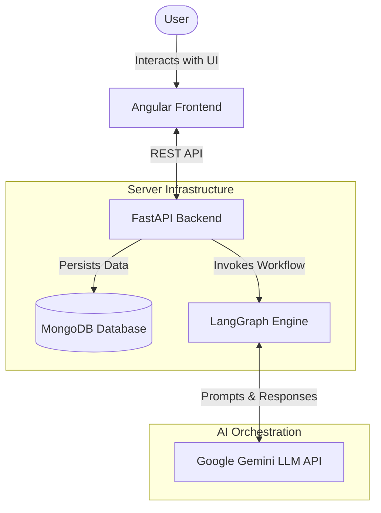
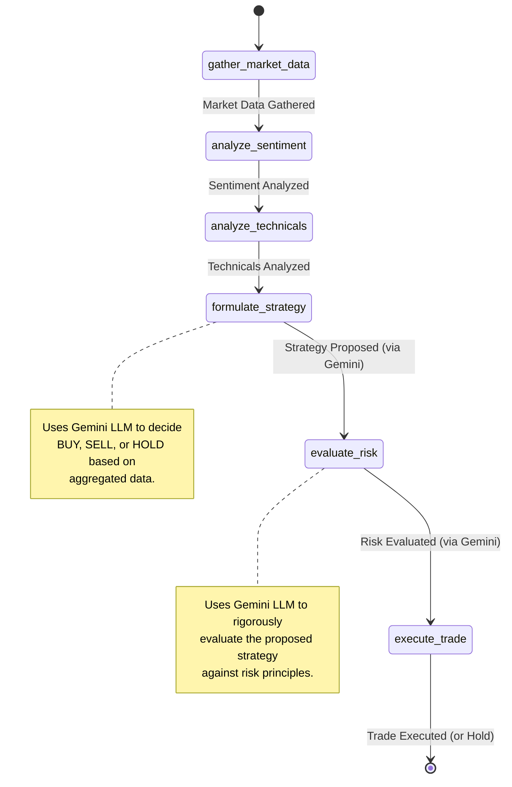

# Automated Crypto Trading System

This repository contains a full-stack, automated cryptocurrency trading system. It features an Angular-based frontend and a Python FastAPI backend that leverages **LangGraph** and **Google Gemini** (LLM) to orchestrate a team of AI agents. These agents analyze market data, sentiment, and technical indicators to formulate and execute trading strategies.

## Architectural Insights

The system is designed with a modern, decoupled architecture:

*   **Frontend:** Built with Angular 21, the frontend provides a user interface to view portfolio status, recent trades, system logs, and manually trigger new trading cycles for specific assets.
*   **Backend:** Developed using Python and FastAPI, it serves as the central orchestrator. It handles RESTful API requests from the frontend, manages database connections, and triggers the AI agent workflows.
*   **Agent Orchestration (LangGraph):** The core intelligence of the system is modeled as a state graph using LangGraph. This allows for a structured, multi-agent workflow where data is passed sequentially from data gatherers to analysts, strategists, and finally execution managers.
*   **LLM Integration:** Google's Gemini-1.5-pro model is utilized within specific agents (Strategy/Decision and Risk Management) to process complex data and output structured decisions and reasoning.
*   **Database:** MongoDB is used for persistent storage of portfolios, trade histories, and execution logs. The system also includes an in-memory fallback mechanism if a local MongoDB instance is not available.

## Agentic Workflow

The core trading intelligence is powered by a multi-agent system orchestrated by LangGraph. Each agent has a specific role, contributing to a robust, AI-driven trading decision.

### Agents and Their Roles

1.  **Market Data Gatherer:**
    *   **Role:** Collects real-time market data (e.g., current price, volume, trend).
    *   **Value:** Provides the foundational quantitative context needed for any trading decision.
2.  **Sentiment Analyst:**
    *   **Role:** Analyzes market sentiment (e.g., news headlines, social media trends) and provides a sentiment score and summary.
    *   **Value:** Captures the emotional and qualitative market drivers, which are crucial in highly volatile crypto markets.
3.  **Technical Analyst:**
    *   **Role:** Computes and evaluates technical indicators (e.g., RSI, MACD crossovers).
    *   **Value:** Identifies short-term momentum and historical price patterns to time market entries and exits.
4.  **Strategy/Decision Agent (LLM-Powered):**
    *   **Role:** Aggregates data from the Gatherer, Sentiment, and Technical analysts. It uses Google Gemini to formulate a trading strategy, outputting an ACTION (BUY, SELL, HOLD), AMOUNT, and detailed REASONING.
    *   **Value:** Acts as the "brain," synthesizing diverse data streams to make intelligent, context-aware decisions rather than relying on rigid, rule-based algorithms.
5.  **Risk Manager (LLM-Powered):**
    *   **Role:** Receives the proposed strategy and acts as a strict safeguard. It uses Google Gemini to evaluate the proposed trade against standard risk management principles. It has the authority to APPROVE or REJECT the trade.
    *   **Value:** Protects the portfolio from severe drawdowns by vetoing trades that exhibit excessive risk or irrational exuberance, ensuring long-term capital preservation.
6.  **Execution Agent:**
    *   **Role:** Handles the final step. If a trade is approved by the Risk Manager, this agent executes the order (e.g., calling a broker API or updating the local database).
    *   **Value:** Automates the physical trade execution, removing human latency and emotional hesitation.

### Control and Communication Flow

The agents do not communicate with each other directly or randomly. Instead, their execution is strictly controlled by a **LangGraph state machine**. 

A shared `AgentState` object acts as the single source of truth and the medium for communication. As the graph executes sequentially, each agent receives the state, performs its specific computation or LLM invocation, appends its findings to the state, and passes the enriched state to the next agent down the pipeline. This ensures a predictable, auditable, and orderly flow of information from raw data gathering to final execution.

## Module Interactions

1.  **User Interaction:** The user interacts with the Angular frontend to request a new trading cycle for an asset (e.g., BTC).
2.  **API Communication:** The frontend sends a `POST /api/trigger_cycle` request to the FastAPI backend.
3.  **Graph Execution:** The backend initializes a state object and invokes the LangGraph `trading_graph`.
4.  **Agent Flow:** The state object is passed through the predefined nodes in the LangGraph (gathering data, analyzing, formulating strategy, evaluating risk). LLM calls are made asynchronously as needed.
5.  **Data Persistence:** Once the graph execution completes, the backend saves the generated logs and any executed trades to MongoDB (or the mock database). It also updates the current portfolio holdings.
6.  **Response:** A summary response is sent back to the frontend, updating the UI with the latest trade and log data.

## System Diagrams

### Overall System Design



### LangGraph State Flow

The following diagram details the sequential execution of the AI agents within the LangGraph workflow:



## Setup and Run Instructions

### Prerequisites
*   Node.js and npm (for the frontend)
*   Python 3.8+ (for the backend)
*   [MongoDB](https://www.mongodb.com/) (Optional: The backend will fall back to an in-memory mock database if MongoDB is not running locally on port 27017)
*   A Google Gemini API Key

### Backend Setup
1.  Navigate to the backend directory:
    ```bash
    cd backend
    ```
2.  Install Python dependencies:
    ```bash
    pip install -r requirements.txt
    ```
3.  Set your Google Gemini API key as an environment variable (required for the LLM agents to function):
    ```bash
    export GOOGLE_API_KEY="your_actual_api_key_here"
    ```
4.  Start the FastAPI server:
    ```bash
    uvicorn main:app --reload
    ```
    *The backend will be available at http://localhost:8000.*

### Frontend Setup
1.  Navigate to the frontend directory:
    ```bash
    cd frontend
    ```
2.  Install Node.js dependencies:
    ```bash
    npm install
    ```
3.  Start the Angular development server:
    ```bash
    npm start
    ```
    *The frontend will be available at http://localhost:4200.*
